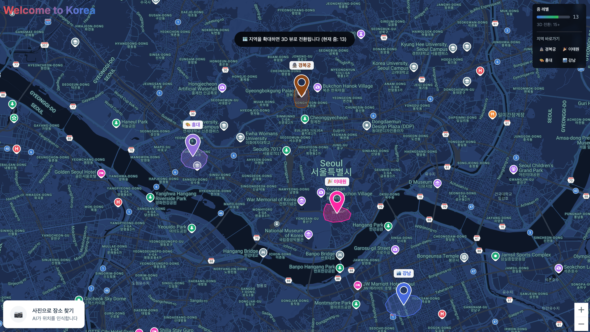

# Welcome to Korea 🇰🇷

> **Experience Korea before you arrive** — An immersive 3D map service that brings Korean culture to life

[](https://developers.google.com/maps)
[](https://ai.google.dev/)
[](https://nextjs.org/)
[](https://www.typescriptlang.org/)

<p align="center">
  
</p>

## The Problem

Have you ever relied on Google Maps while traveling abroad? The **Bird's Eye View** feature helps you understand unfamiliar spaces at a glance, providing crucial spatial context.

But here's what most people don't know: **Google Maps in Korea is fundamentally different from the rest of the world.**

Due to national security regulations, aerial precision imagery collection is restricted in South Korea. This means:
- ❌ No Bird's Eye View
- ❌ Limited 3D building data
- ❌ Reduced spatial context for navigation

**Foreign visitors to Korea can't enjoy the same rich map experience they're used to back home.**

## Our Solution

**Welcome to Korea** reconstructs 3D spatial experiences **without** restricted aerial imagery.

We leverage publicly available data:
- 📍 **Street View images** — Already permitted and widely available
- 🗺️ **Coordinate & location data** — Public geographic information
- 🤖 **Google Gemini AI** — Contextual understanding and generation

These elements are combined to create an immersive 3D representation that goes beyond simple navigation.

## Key Features

### 🏛️ Cultural Context, Not Just Maps

We don't just show you *where* — we show you *what it feels like*.

| Gyeongbokgung Palace | Hongdae |
|:---:|:---:|
| Avatars in traditional Hanbok | Street artists with berets |
| Serene, historical atmosphere | Vibrant, youthful energy |
| Royal Korean heritage | Modern indie culture |

Each location features:
- **Custom avatars** dressed appropriately for the area
- **Culturally-relevant animations** (traditional walks, street dancing)
- **Location-specific building textures**
- **Real-world scale** based on actual measurements

### 🎯 Interactive Discovery

- **Color-highlighted tourist zones** on the main Seoul map
- **Click or zoom** to enter detailed 3D views
- **Contextual information** about food, transportation, and local customs

### 📱 What You'll Learn

For each location, discover:
- 🍜 What to eat
- 🚇 How to get around
- 🎭 Cultural experiences to try
- 📸 Photo spots and tips

## Tech Stack

| Category | Technology |
|----------|------------|
| **Frontend** | Next.js, TypeScript, Tailwind CSS |
| **Maps** | Google Maps Platform API |
| **AI** | Google Gemini |
| **3D Rendering** | Three.js / WebGL |
| **Deployment** | Vercel, Docker |

## Getting Started

### Prerequisites

- Node.js 18+
- Google Maps API Key
- Google Gemini API Key

### Installation

```bash
# Clone the repository
git clone https://github.com/gemini-hackerthon-real/welcome-to-korea.git
cd welcome-to-korea

# Install dependencies
npm install

# Set up environment variables
cp .env.example .env.local
# Edit .env.local with your API keys

# Run development server
npm run dev
```

Open [http://localhost:3000](http://localhost:3000) to explore.

## Project Structure

```
welcome-to-korea/
├── src/                    # Source code
├── DEPLOYMENT.md           # Deployment guide
├── IMPLEMENTATION.md       # Implementation details
├── PROJECT_PLAN.md         # Project planning docs
└── ...
```

## Our Vision

> **Protect Korea's security. Share Korea's charm.**

Welcome to Korea creatively overcomes regulatory constraints to help foreign visitors experience Korean spaces more deeply, richly, and joyfully.

We believe a map app should do more than give directions — it should **spark the excitement of travel itself**.

---

## Team

Built with ❤️ for the **Google Gemini Hackathon**

## License

This project is licensed under the MIT License.

---

<p align="center">
  <b>Welcome to Korea</b> — Where every map tells a story
</p>
